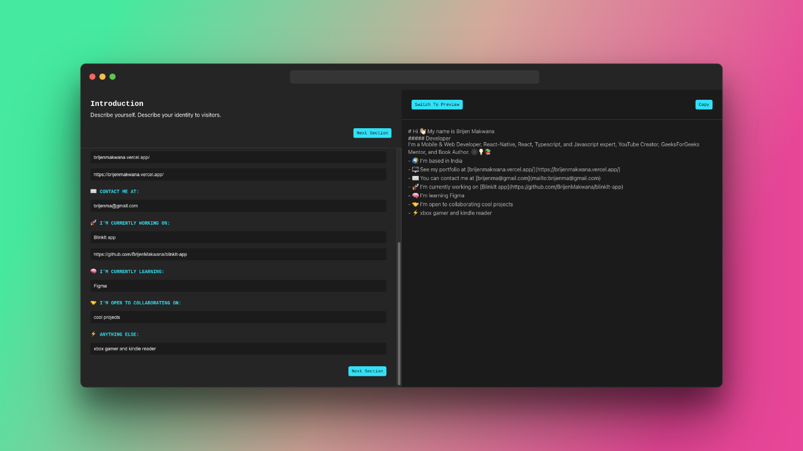
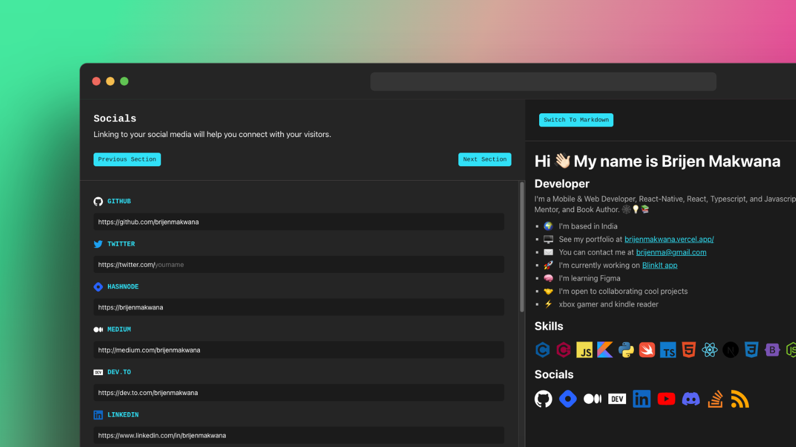
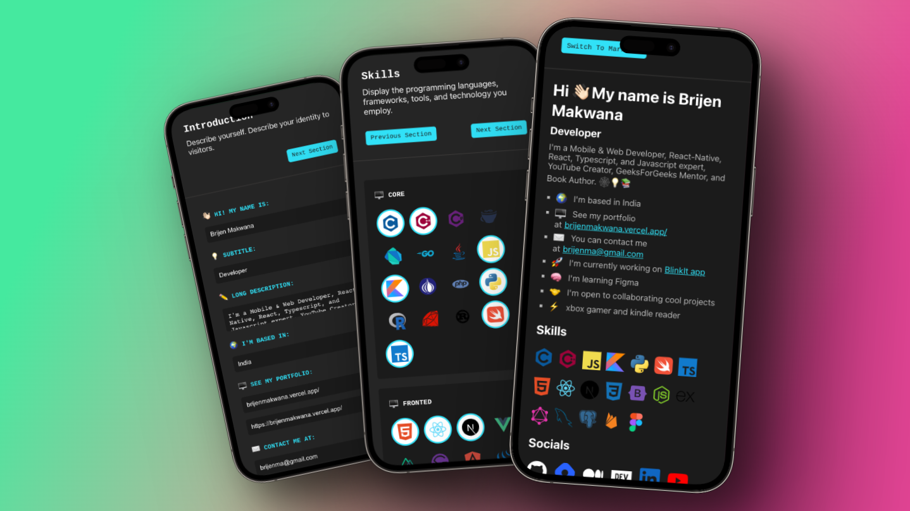

# GitHub Profile Generator

This project is inspired by [profileme.dev](https://www.profileme.dev), but the implementation is my own 😀

## Table of contents

- [Overview](#overview)
- [Screenshot](#screenshot)
- [Links](#links)
- [Built with](#Built-with)

## Overview

- In a few minutes, create a stunning GitHub profile.
- Display your abilities. Choose from more than 60 fundamental languages, frameworks, backend technologies, and web 3 technologies.
- Share on social media. Easily add links to all of your social media profiles and blogs.
- Copy your profile code after you're finished, and you're good to go!

## Screenshot

## Links

- Live Site URL: [https://github-profile-generator.vercel.app](https://github-profile-generator.vercel.app)

## Built with

- React
- Javascript
- CSS
- Context API
